# VSDBabySoC: A Comprehensive Guide to RISC-V Based SoC Design


[](https://riscv.org/)
[](https://vsdiat.vlsisystemdesign.com/)
[]()

---

## 📑 Table of Contents

- [Overview](#overview)
- [Problem Statement](#problem-statement)
- [Understanding System-on-Chip (SoC)](#understanding-system-on-chip-soc)
  - [What is an SoC?](#what-is-an-soc)
  - [Key Components](#key-components)
  - [Why SoCs Matter](#why-socs-matter)
  - [Real-World Applications](#real-world-applications)
  - [Popular SoCs](#popular-socs)
  - [Design Challenges](#design-challenges)
- [Types of SoCs](#types-of-socs)
- [Introduction to VSDBabySoC](#introduction-to-vsdbabysoc)
  - [Architecture Overview](#architecture-overview)
  - [Operational Flow](#operational-flow)
- [Core Components Deep Dive](#core-components-deep-dive)
  - [RVMYTH: The RISC-V Brain](#rvmyth-the-risc-v-brain)
  - [PLL: The Clock Maestro](#pll-the-clock-maestro)
  - [DAC: The Digital-to-Analog Bridge](#dac-the-digital-to-analog-bridge)
- [The SoC Design Journey](#the-soc-design-journey)
  - [Complete Design Flow](#complete-design-flow)
  - [Functional Modeling Stage](#functional-modeling-stage)
- [How VSDBabySoC Works](#how-vsdbabysoc-works)
- [Open-Source Ecosystem](#open-source-ecosystem)
  - [IP Cores](#ip-cores)
  - [Design Tools](#design-tools)
  - [Why Open Source?](#why-open-source)
- [Mixed-Signal Design Challenges](#mixed-signal-design-challenges)
- [Learning Outcomes](#learning-outcomes)
- [Conclusion](#conclusion)

---

## 🎯 Overview

**VSDBabySoC** is a compact, open-source **System on Chip (SoC)** designed as an educational platform for learning digital-analog interfacing and RISC-V based processor design. Built on the **Sky130 technology node**, this project integrates three fundamental IP cores to create a functional mixed-signal system capable of generating analog outputs from digital processing.

This SoC serves as a bridge between theoretical knowledge and practical implementation, demonstrating how modern chips integrate digital processing with analog interfaces to communicate with the real world.

---

## 📋 Problem Statement

This project addresses the challenge of designing a **compact, open-source System on Chip (SoC)** that combines:

- **RVMYTH**: A RISC-V-based processor core for digital computation
- **Phase-Locked Loop (PLL)**: For precise clock generation and synchronization
- **10-bit Digital-to-Analog Converter (DAC)**: For interfacing with external analog systems

### Why This Matters

**For Students:**
- Gain practical skills employers value
- Build portfolio-worthy projects
- Understand cutting-edge technology
- Prepare for semiconductor careers

**For Educators:**
- Teach with real tools and flows
- Provide hands-on experiences
- Connect theory to practice
- Inspire the next generation

**For the Industry:**
- Develop skilled workforce
- Foster innovation
- Reduce barriers to entry
- Accelerate technology advancement

**For Society:**
- Democratize technology education
- Enable global participation
- Drive economic opportunity
- Advance technological progress

### Key Takeaways

Through VSDBabySoC, we understand that:

1. **Abstraction is Essential**
   - Start with behavioral models before diving into implementation
   - Each level of abstraction serves a purpose
   - High-level thinking guides low-level design

2. **Integration is Hard**
   - Connecting components requires careful attention
   - Interfaces are as important as the blocks themselves
   - Timing, power, and signals all must align

3. **Mixed-Signal is Different**
   - Digital and analog worlds have different rules
   - Careful isolation and interface design required
   - Verification becomes more complex

4. **Tools Matter**
   - Open-source tools democratize access
   - Learning curves exist but resources help
   - Community support is invaluable

5. **Education Through Simplification**
   - Simple examples teach universal principles
   - Complexity can be added incrementally
   - Understanding fundamentals enables scaling

### The Journey Ahead

This documentation represents the **beginning** of your journey with VSDBabySoC, not the end. From here, you can:

**Continue Learning:**
- Deep dive into each component
- Experiment with modifications
- Explore advanced features
- Study related technologies

**Build Something:**
- Complete the full design flow
- Create your own applications
- Extend the functionality
- Share with the community

**Contribute:**
- Improve documentation
- Fix bugs
- Add features
- Help others learn

**Innovate:**
- Apply concepts to new problems
- Create novel designs
- Push boundaries
- Advance the field

### Final Thoughts

**VSDBabySoC is proof that:**

> **"Complex systems are built from simple, well-understood components working together harmoniously."**

The same principles that make BabySoC work—modularity, hierarchy, clear interfaces, and careful design—apply to the most advanced chips powering today's technology.

Whether you're designing a simple microcontroller or a cutting-edge AI processor, the fundamentals remain constant:
- Understand what you're building (specification)
- Design it thoughtfully (architecture)
- Verify it works (simulation and testing)
- Implement it carefully (physical design)
- Validate it thoroughly (verification)

**The open-source movement has made this knowledge accessible to everyone.** What you do with it is up to you.

---


## 📖 Appendix: Quick Reference

### Common Commands

**Simulation:**
```bash
# Compile Verilog
iverilog -o output.vvp testbench.v design.v

# Run simulation
vvp output.vvp

# View waveforms
gtkwave waveform.vcd
```

**Synthesis:**
```bash
# Yosys synthesis
yosys -p "read_verilog design.v; synth -top module_name; write_verilog synth.v"
```

**Physical Design:**
```bash
# Run OpenLANE flow
./flow.tcl -design design_name -tag run_name
```

### Key Terminology

| Term | Definition |
|------|------------|
| **SoC** | System on Chip - complete system on single die |
| **IP** | Intellectual Property - reusable design block |
| **RTL** | Register Transfer Level - hardware description |
| **PLL** | Phase-Locked Loop - clock generation circuit |
| **DAC** | Digital-to-Analog Converter |
| **PDK** | Process Design Kit - manufacturing rules |
| **GDSII** | Graphics Database System II - layout format |
| **DRC** | Design Rule Check - manufacturing verification |
| **LVS** | Layout vs Schematic - connectivity check |
| **STA** | Static Timing Analysis - timing verification |

### Signal Naming Conventions

```verilog
// Common naming patterns
clk         // Clock signal
rst         // Reset (active high)
rst_n       // Reset (active low)
enable      // Enable signal
ready       // Ready flag
valid       // Valid data indicator
data[N:0]   // Data bus
addr[M:0]   // Address bus
```

### Useful Formulas

**DAC Output Voltage:**
```
Vout = (Digital_Input / 2^n) × Vref
```

**Clock Frequency:**
```
fout = fin × (M/N)
Where M = multiplier, N = divider
```

**Setup Time Requirement:**
```
Tclk ≥ Tck→q + Tlogic + Tsetup + Tskew
```

**Maximum Frequency:**
```
fmax = 1 / Tcritical_path
```

### File Extensions

| Extension | Description |
|-----------|-------------|
| `.v` | Verilog source file |
| `.sv` | SystemVerilog source |
| `.vcd` | Value Change Dump (waveform) |
| `.lib` | Liberty timing library |
| `.lef` | Library Exchange Format |
| `.def` | Design Exchange Format |
| `.gds` / `.gdsii` | Layout database |
| `.sdc` | Synopsys Design Constraints |
| `.sdf` | Standard Delay Format |

---


**Welcome to the world of open-source silicon. Welcome to VSDBabySoC.** 🎉

</div> The Challenge

By converting digital signals into analog outputs, this DAC enables BabySoC to communicate with devices that accept analog inputs, such as:
- Televisions
- Mobile phones
- Audio systems
- Display devices

### The Goal

Create a highly documented, educational platform built on Sky130 technology that provides:
- ✅ Hands-on experience with SoC design
- ✅ Understanding of digital-analog interfacing
- ✅ Practical RISC-V processor implementation
- ✅ Complete design flow from specification to layout

---

## 🔍 Understanding System-on-Chip (SoC)

### What is an SoC?

A **System on a Chip (SoC)** is like a **mini-computer built on a single chip**. Instead of needing separate components scattered across a circuit board for each function, an SoC integrates everything into one small package. This integration is crucial for modern devices where space, power efficiency, and performance are paramount.

Think of it as putting an entire computer system—processor, memory, input/output interfaces, and specialized circuits—onto a single piece of silicon no larger than your fingernail.

### Key Components

Every SoC is built from fundamental building blocks that work together to create a complete system:

#### 1. **CPU (Central Processing Unit)**
- **Role**: The brain of the SoC
- **Function**: Handles all main instructions and decisions
- **Tasks**: 
  - Performing calculations
  - Processing data
  - Running applications
  - Coordinating other components

#### 2. **Memory Subsystem**
- **RAM (Random Access Memory)**:
  - Temporarily stores data during operation
  - Fast access for active processes
  - Volatile (data lost when power is off)
- **ROM/Flash Storage**:
  - Permanent storage for firmware and data
  - Retains information without power
  - Slower than RAM but persistent

#### 3. **I/O Ports (Input/Output)**
- **Purpose**: Connects the SoC to external world
- **Examples**:
  - Camera interfaces
  - USB ports
  - Audio jacks
  - Display connectors
  - Network interfaces
- **Function**: Enable data exchange with peripherals

#### 4. **GPU (Graphics Processing Unit)**
- **Specialization**: Visual processing
- **Applications**:
  - Gaming graphics
  - Video playback
  - Image processing
  - UI rendering
  - Animations

#### 5. **DSP (Digital Signal Processor)**
- **Expertise**: Audio and video signal processing
- **Use Cases**:
  - Noise reduction in phone calls
  - Video quality enhancement
  - Audio effects
  - Image filtering
  - Real-time signal manipulation

#### 6. **Power Management Unit**
- **Critical Role**: Regulates power consumption
- **Functions**:
  - Voltage regulation
  - Power distribution
  - Battery optimization
  - Thermal management
  - Dynamic power scaling

#### 7. **Specialized Features**
- **Communication**: Wi-Fi, Bluetooth, cellular modems
- **Security**: Encryption engines, secure enclaves
- **AI Accelerators**: Neural processing units
- **Custom Logic**: Application-specific circuits

### Why SoCs Matter

SoCs have revolutionized electronics by offering compelling advantages:

#### **1. Space Efficiency**
- Combines multiple components into a single chip
- Enables smaller, more portable devices
- Reduces board size and complexity
- Critical for wearables and mobile devices

#### **2. Energy Efficiency**
- Components placed close together reduce power consumption
- Shorter electrical paths mean less energy loss
- Essential for battery-operated devices
- Extends device runtime significantly

#### **3. High Performance**
- Data travels shorter distances between components
- Faster communication between subsystems
- Reduced latency in operations
- Better overall system responsiveness

#### **4. Cost Effectiveness**
- Single chip production is cheaper than multiple components
- Reduced assembly costs
- Lower testing complexity
- More affordable consumer devices

#### **5. Enhanced Reliability**
- Fewer interconnections mean fewer failure points
- Better manufacturing yield
- Improved system stability
- Longer device lifespan

### Real-World Applications

SoCs power virtually every modern electronic device:

#### **Smartphones & Tablets**
- Integrate CPU, GPU, modem, and more
- Power efficiency critical for battery life
- Examples: Apple A-series, Snapdragon

#### **Wearables**
- Smartwatches and fitness trackers
- Extreme space and power constraints
- Must be ultra-compact and efficient

#### **IoT Devices**
- Smart home sensors
- Connected appliances
- Industrial monitoring systems
- Environmental sensors

#### **Automotive Systems**
- Infotainment systems
- Advanced driver assistance
- Engine control units
- Autonomous driving computers

#### **Consumer Electronics**
- Smart TVs
- Set-top boxes
- Gaming consoles
- Home entertainment systems

### Popular SoCs

#### **Apple A-Series**
- Powers iPhones and iPads
- Custom ARM-based design
- Leading performance and efficiency

#### **Qualcomm Snapdragon**
- Dominant in Android phones
- Integrated cellular connectivity
- Wide range of performance tiers

#### **Samsung Exynos**
- Used in Samsung devices
- Custom CPU cores
- Integrated graphics

#### **NVIDIA Tegra**
- Gaming-focused design
- Powers Nintendo Switch
- Strong graphics capabilities

#### **MediaTek Dimensity**
- Cost-effective solutions
- 5G integration
- Popular in mid-range devices


### Design Challenges

Creating an SoC is a complex undertaking with significant hurdles:

#### **1. Design Complexity**
- Integrating diverse functions on one chip
- Managing interactions between components
- Requires advanced engineering skills
- Long development cycles

#### **2. Thermal Management**
- High component density generates heat
- Cooling solutions needed
- Power density management critical
- Affects performance and reliability

#### **3. Limited Flexibility**
- Once fabricated, cannot be modified
- Must anticipate all use cases upfront
- Design for specific applications
- Trade-offs between specialization and versatility

#### **4. Verification Challenge**
- Ensuring all components work together
- Complex testing scenarios
- Analog-digital integration issues
- Time-consuming validation process

#### **5. Power Delivery**
- Different components need different voltages
- Dynamic power requirements
- Noise isolation between blocks
- Efficiency optimization

---

## 🏗️ Types of SoCs

SoCs can be categorized based on their primary processing core and intended application:

### 1. Microcontroller-Based SoC

**Characteristics:**
- Built around a microcontroller core
- Optimized for control and monitoring tasks
- Low power consumption is primary goal
- Simple architecture

**Typical Applications:**
- Home appliances (washing machines, refrigerators)
- Automotive control systems (ABS, engine management)
- IoT devices (sensors, smart switches)
- Industrial automation
- Consumer electronics (remote controls, thermostats)

**Advantages:**
- Extremely power-efficient
- Cost-effective
- Real-time operation capability
- Deterministic behavior

**VSDBabySoC Parallel:**
- RVMYTH's simplicity mirrors this category
- Designed for educational control applications

### 2. Microprocessor-Based SoC

**Characteristics:**
- Features a powerful microprocessor
- Can run complex operating systems (Linux, Android, iOS)
- Higher processing power
- Multi-core architectures common

**Typical Applications:**
- Smartphones and tablets
- Laptop computers
- Gaming devices
- Servers and networking equipment
- High-performance embedded systems

**Advantages:**
- Can handle multiple tasks simultaneously
- Supports complex software ecosystems
- Flexible programming environment
- Rich peripheral integration

**VSDBabySoC Parallel:**
- Could potentially be extended for OS support
- Foundation for understanding processor-based designs

### 3. Application-Specific SoC (ASIC)

**Characteristics:**
- Custom-designed for specific tasks
- Optimized for particular functions
- Maximum efficiency for intended use
- Specialized hardware accelerators

**Typical Applications:**
- Graphics cards (GPU-focused)
- AI/ML accelerators (neural network processing)
- Cryptocurrency mining
- Network processors
- Video encoding/decoding
- Telecommunications equipment

**Advantages:**
- Unmatched performance in target application
- Optimized power consumption
- Reduced latency for specific tasks
- Can be more cost-effective at scale

**VSDBabySoC Parallel:**
- PLL and DAC represent specialized IP blocks
- Demonstrates how custom IP integrates with general processing

### Comparison Table

| Feature | Microcontroller | Microprocessor | Application-Specific |
|---------|----------------|----------------|---------------------|
| **Complexity** | Low | High | Medium to High |
| **Power** | Very Low | High | Task-Dependent |
| **Cost** | Low | Medium-High | High (NRE), Low (volume) |
| **Flexibility** | Limited | High | Very Limited |
| **Performance** | Adequate | High | Optimal (for task) |
| **OS Support** | RTOS/Bare-metal | Full OS | Varies |

---

## 🚀 Introduction to VSDBabySoC

VSDBabySoC is a **compact yet powerful System on Chip** that serves as an educational platform for understanding modern SoC design principles. Built on the **RISC-V architecture**, it represents a complete mixed-signal system that bridges digital processing with analog output.

### Why VSDBabySoC?

This SoC is specifically designed as a learning platform because it:

#### **1. Simplifies Complexity**
- Focuses on core concepts without overwhelming details
- Manageable size for educational purposes
- Clear signal flow and component interactions
- Well-documented design decisions

#### **2. Demonstrates Mixed-Signal Design**
- Combines digital (RVMYTH) and analog (PLL, DAC) components
- Shows real-world integration challenges
- Practical example of signal conversion
- Teaches interface design principles

#### **3. Open-Source Foundation**
- Complete transparency in design
- Accessible to students and researchers
- Community-driven improvements
- No licensing barriers

#### **4. Complete Design Flow**
- Covers specification to fabrication
- Includes all design stages
- Teaches industry-standard methodologies
- Provides hands-on experience

#### **5. Real-World Application**
- Generates actual analog outputs
- Can interface with real devices
- Demonstrates practical utility
- Bridges theory and practice

### Architecture Overview

VSDBabySoC integrates three critical IP cores:
 
### Operational Flow

#### **Stage 1: Initialization and Clock Generation**
Upon receiving the initial input signal:
- **Reset Signal**: Initializes the RVMYTH processor
- **PLL Activation**: Receives reference clock signal
- **Lock Process**: PLL begins frequency stabilization
- **System Ready**: Stable clock distributed to RVMYTH

**Why This Matters:**
- Clock synchronization is critical for digital circuits
- All operations must be synchronized to prevent data corruption
- PLL ensures timing consistency across the system

#### **Stage 2: Data Processing in RVMYTH**
The processor executes its program:
- **Instruction Fetch**: Reads from internal memory
- **Execution**: Processes data per RISC-V ISA
- **Register Update**: Stores results in register `r17`
- **Continuous Operation**: Cycles through programmed sequence

**Key Register: r17**
- Holds the data to be converted to analog
- Updated by processor instructions
- Connected to DAC input bus
- 10-bit width for DAC resolution

#### **Stage 3: Analog Signal Generation via DAC**
Digital-to-analog conversion:
- **Input**: 10-bit digital value from `RV_TO_DAC[9:0]`
- **Conversion**: Transforms to voltage level
- **Output**: Analog signal on `DAC.OUT`
- **Application**: Can drive external analog devices

**Real-World Usage:**
- Audio output to speakers
- Video signals to displays
- Control signals to analog systems
- Sensor interface outputs

#### **Stage 4: Observable Outputs**
System generates multiple observable signals:
- **Digital Bus**: `RV_TO_DAC[9:0]` - can be monitored digitally
- **Analog Output**: `DAC.OUT` - real voltage level
- **Status Signals**: Clock, reset, control signals
- **Debug Points**: Internal processor states

### Data Flow Diagram

```
Input (REF_CLK)
      │
      ▼
┌─────────────┐
│     PLL     │ Generates stable system clock
└──────┬──────┘
       │ CLK
       ▼
┌─────────────┐
│   RVMYTH    │ Processes instructions
│             │ Updates r17 register
└──────┬──────┘
       │ RV_TO_DAC[9:0]
       ▼
┌─────────────┐
│     DAC     │ Converts to analog
└──────┬──────┘
       │
       ▼
   ANALOG_OUT (Can drive: TVs, phones, audio devices)
```

### Design Objectives

The VSDBabySoC project aims to:

1. **Facilitate First-Time Integration**
   - Testing three open-source IPs together
   - Validating inter-block communication
   - Demonstrating complete system functionality

2. **Calibrate Analog Components**
   - Verify PLL lock range and stability
   - Validate DAC linearity and accuracy
   - Test mixed-signal interfaces

3. **Provide Educational Value**
   - Teach SoC integration principles
   - Demonstrate design flow stages
   - Offer hands-on learning experience

4. **Enable Further Development**
   - Platform for experimenting with RISC-V
   - Testbed for new IP blocks
   - Foundation for more complex designs

---

## 🔧 Core Components Deep Dive

### RVMYTH: The RISC-V Brain

#### What is RVMYTH?

**RVMYTH** (RISC-V Microprocessor Yielding Teaching Horizons) is an educational **RISC-V processor core** designed specifically for learning processor architecture and SoC integration. It implements the open RISC-V instruction set architecture (ISA).

#### Key Features

**1. RISC-V ISA Compliance**
- Follows the open RISC-V specification
- Implements base integer instruction set (RV32I)
- No proprietary licensing required
- Industry-standard architecture

**2. Transaction-Level Verilog (TLV)**
- Written in TL-Verilog for clarity
- Higher abstraction than traditional RTL
- Easier to understand and modify
- Automatic pipelining capabilities

**3. Educational Design**
- Simplified for learning purposes
- Clear pipeline stages
- Visible internal states
- Well-documented architecture

**4. Customizable Core**
- Can be extended with additional instructions
- Modifiable pipeline depth
- Configurable register file
- Adaptable for different applications

#### Architecture Details

**Pipeline Stages:**
```
Fetch → Decode → Execute → Memory → Writeback
```

**Register File:**
- 32 general-purpose registers (x0-x31)
- Register x0 hardwired to zero
- Register r17 (x17) used for DAC output
- 32-bit width per register

**Memory Interface:**
- Instruction memory (IMEM)
- Data memory (DMEM)
- Simple interface for educational purposes
- Can be extended for cache integration

**Control Flow:**
- Supports branches and jumps
- Program counter management
- Hazard detection
- Control signal generation

#### Role in BabySoC

1. **Central Processing**
   - Executes the main program
   - Generates data for DAC output
   - Controls system behavior

2. **Data Generation**
   - Computes values in register r17
   - These values drive the DAC
   - Can create waveforms, patterns, or control signals

3. **System Coordination**
   - Responds to clock from PLL
   - Operates synchronously
   - Maintains timing relationships

#### Sample Application

In BabySoC, RVMYTH might run a program that:
```
1. Initialize r17 to 0
2. Loop:
   a. Increment r17
   b. Output to DAC (automatic via connection)
   c. Delay
   d. Check for maximum value
   e. Reset or continue
```

This creates a **ramp waveform** on the DAC output, demonstrating:
- Digital computation
- Sequential logic
- Analog output generation

---

### PLL: The Clock Maestro

#### What is a Phase-Locked Loop?

A **Phase-Locked Loop (PLL)** is a control system that generates an output signal whose phase and frequency are synchronized with an input reference signal. It's the heartbeat of the SoC, ensuring all digital operations occur at precisely the right time.

#### Block Diagram and Components

<br>

#### Core Components Explained

**1. Phase Detector (PD)**
- **Function**: Compares input signal with feedback signal
- **Output**: Error signal proportional to phase difference
- **Types**: XOR, edge-triggered, or mixer-based
- **Role**: Measures how far the output is from desired frequency

**2. Loop Filter (LF)**
- **Function**: Processes the error signal
- **Type**: Usually a low-pass filter
- **Purpose**: 
  - Smooths the error signal
  - Removes high-frequency noise
  - Determines loop dynamics
- **Output**: Control voltage for VCO

**3. Voltage-Controlled Oscillator (VCO)**
- **Function**: Generates output clock
- **Control**: Frequency varies with input voltage
- **Range**: Must cover desired frequency range
- **Output**: High-frequency clock signal

**4. Frequency Divider (Optional)**
- **Function**: Divides output frequency
- **Purpose**: Enables frequency multiplication
- **Example**: Divide by 8 means output is 8× input
- **In BabySoC**: Creates 8× reference frequency

#### How PLLs Work

**Lock Process:**

1. **Initial State**:
   - VCO runs at approximate frequency
   - Phase detector sees large error
   - Loop filter begins correction

2. **Acquisition**:
   - VCO frequency pulled toward target
   - Error signal decreases
   - System approaches lock

3. **Locked State**:
   - Output frequency matches target
   - Phase difference constant (or zero)
   - System maintains synchronization

4. **Tracking**:
   - Compensates for variations
   - Follows input frequency changes
   - Maintains lock despite noise

#### Why PLLs Are Essential in SoCs

**1. Clock Multiplication**
- Input: Slow external crystal (e.g., 10 MHz)
- Output: Fast system clock (e.g., 80 MHz for 8× PLL)
- Benefit: Don't need high-frequency crystals

**2. Clock Synchronization**
- Aligns clock edges across chip
- Compensates for distribution delays
- Ensures setup/hold times met

**3. Noise Filtering**
- Attenuates jitter on input
- Provides clean clock output
- Critical for high-speed operation

**4. Flexible Frequency Generation**
- One reference can generate multiple frequencies
- Different blocks can run at different speeds
- Programmable frequency ratios

#### Why External Clocks Aren't Always Sufficient

**1. Clock Distribution Delays**
- Long wires cause signal delays
- Clock arrives at different times to different blocks
- Can violate timing requirements
- PLL can regenerate clock locally

**2. Clock Jitter**
- External clocks have timing variation
- Jitter accumulates over distribution
- PLL filters and reduces jitter
- Critical for high-speed interfaces

**3. Multiple Frequency Requirements**
- CPU might need 100 MHz
- Peripheral might need 50 MHz
- Memory interface needs 200 MHz
- One PLL with dividers can provide all

**4. Crystal Frequency Limitations**
- Crystals available in limited frequencies
- High frequencies are expensive
- Temperature sensitivity
- PLLs enable using standard crystals

**5. Frequency Error and Stability**
- **PPM (Parts Per Million)**: Measures crystal accuracy
  - 50 ppm = 50 Hz error per 1 MHz
  - Higher ppm = less accurate
- **Frequency Tolerance**: Initial manufacturing error
- **Frequency Stability**: Variation with temperature
- **Aging**: Frequency drift over years
- **Total Error**: Sum of all contributions

**Example Calculation:**
```
Crystal: 10 MHz, 50 ppm total error
Maximum error = 10,000,000 Hz × 50/1,000,000 = 500 Hz
Frequency range = 10 MHz ± 500 Hz
```

For precision applications, this error is unacceptable. PLLs can lock to the average frequency and provide more stable output.

#### The 8× PLL in BabySoC

**Specifications:**
- **Input**: Reference clock (e.g., 10 MHz)
- **Output**: 8× multiplied clock (e.g., 80 MHz)
- **Purpose**: Provide fast clock for RVMYTH
- **Stability**: Maintains phase lock

**Benefits for BabySoC:**
- Allows slow, stable reference clock
- Generates fast processor clock
- Reduces external component requirements
- Demonstrates PLL integration

---

### DAC: The Digital-to-Analog Bridge

#### What is a Digital-to-Analog Converter?

A **Digital-to-Analog Converter (DAC)** is the interface between the digital world of processors and the analog world we live in. It takes binary numbers and converts them into continuous voltage or current levels.

#### The Need for DACs

**Digital World:**
- Processors work with discrete binary values
- Everything is 0s and 1s
- Fast, precise, easy to store and process

**Analog World:**
- Real-world signals are continuous
- Audio, video, sensor control
- Voltage and current based
- What humans interact with

**DAC's Role:**
- **Translation**: Binary → Voltage
- **Bridge**: Digital system → Analog device
- **Interface**: Processor → Real world

#### 10-Bit DAC Specifications

**Resolution:**
- **Bit Width**: 10 bits
- **Levels**: 2^10 = 1024 distinct output levels
- **Digital Input Range**: 0 to 1023 (decimal)
- **Binary Range**: 0000000000 to 1111111111

**Voltage Mapping** (Example):
- Reference Voltage (Vref) = 3.3V
- LSB (Least Significant Bit) = 3.3V / 1024 ≈ 3.22 mV
- Output = (Digital_Value / 1024) × Vref

**Examples:**
```
Input: 0000000000 (0)    → Output: 0.000 V
Input: 0000000001 (1)    → Output: 0.003 V
Input: 0100000000 (512)  → Output: 1.650 V
Input: 1111111111 (1023) → Output: 3.300 V
```

#### DAC Architectures

VSDBabySoC could use either of two common DAC types:

**1. Weighted Resistor DAC**

  

**How It Works:**
- Each bit controls a switch
- Resistors weighted by powers of 2
- Current from each bit is binary-weighted
- Currents sum at output

**Advantages:**
- Simple concept
- Fast switching
- Direct binary weighting

**Disadvantages:**
- Wide range of resistor values needed
- Hard to manufacture accurately
- Large resistors occupy chip area
- Not practical for high bit counts

**2. R-2R Ladder DAC**

 

**How It Works:**
- Uses only two resistor values: R and 2R
- Each section divides voltage by 2
- Switches route current to output or ground
- Binary weighting achieved through division

**Advantages:**
- Only two resistor values needed
- Easier to manufacture accurately
- Better matching between resistors
- Scalable to higher bit counts
- Smaller chip area

**Disadvantages:**
- Slightly more complex routing
- More resistors total

**VSDBabySoC Implementation:**
The R-2R ladder is more commonly used in integrated circuits due to its manufacturability and accuracy, making it likely the choice for this educational SoC.

#### DAC Performance Parameters

**1. Resolution**
- Number of bits (10 in our case)
- Determines smallest voltage step
- More bits = finer control

**2. Accuracy**
- How close output is to ideal
- Affected by resistor matching
- Temperature sensitivity
- Reference voltage stability

**3. Settling Time**
- Time to reach final value
- Important for fast signals
- Determines maximum update rate

**4. Linearity**
- **INL (Integral Non-Linearity)**: Deviation from ideal transfer curve
- **DNL (Differential Non-Linearity)**: Step size variation
- Critical for signal quality

**5. Noise and Glitches**
- Switching transients
- Supply noise coupling
- Digital switching noise

#### Role in BabySoC

**1. System Output Interface**
- Receives data from RVMYTH's r17 register
- Converts to analog voltage
- Provides observable output

**2. Real-World Connection**
- Can drive external analog devices
- Demonstrates digital-analog interfacing
- Enables practical applications

**3. Educational Value**
- Shows mixed-signal integration
- Demonstrates conversion principles
- Teaches interface design

**4. Application Examples**

**Audio Output:**
```
RVMYTH generates: [512, 600, 700, 800, 900, ...]
DAC outputs:      [1.65V, 1.93V, 2.25V, 2.57V, 2.90V, ...]
Result:           Rising tone on speaker
```

**Control Signal:**
```
RVMYTH generates: [0, 256, 512, 768, 1023]
DAC outputs:      [0V, 0.82V, 1.65V, 2.47V, 3.30V]
Result:           Stepped voltage for motor control
```

**Video/Display:**
```
RVMYTH cycles through brightness levels
DAC outputs corresponding voltages
Result: Grayscale display patterns
```

#### Digital-to-Analog Conversion Formula

For a 10-bit DAC with reference voltage Vref:

```
Vout = (Digital_Input / 2^n) × Vref
     = (Digital_Input / 1024) × Vref

Where:
- Digital_Input = value from RVMYTH (0 to 1023)
- n = number of bits (10)
- Vref = reference voltage (typically 3.3V)
```

---

## 🔄 The SoC Design Journey

Understanding the complete SoC design flow is crucial for appreciating where each stage fits and why functional modeling matters.

### Complete Design Flow

```mermaid
flowchart TB
    Start([Start: Product Concept])
    Spec[📋 Specification<br/>Define requirements]
    Arch[🏗️ Architecture<br/>System design]
    BM[🎭 Behavioral Modeling<br/>High-level simulation]
    RTL[⚙️ RTL Design<br/>Hardware description]
    FV[✅ Functional Verification<br/>Testbenches & simulation]
    Syn[🔧 Synthesis<br/>Logic optimization]
    STA[⏱️ Static Timing Analysis<br/>Timing verification]
    PD[📐 Physical Design<br/>Floorplan, Place & Route]
    PV[🔍 Physical Verification<br/>DRC, LVS, Antenna]
    Signoff[✓ Sign-off<br/>Final checks]
    Fab[🏭 Fabrication<br/>Manufacturing]
    End([End: Silicon Chip])

    Start --> Spec
    Spec --> Arch
    Arch --> BM
    BM --> RTL
    RTL --> FV
    FV --> Syn
    Syn --> STA
    STA --> PD
    PD --> PV
    PV --> Signoff
    Signoff --> Fab
    Fab --> End

    %% Feedback loops
    FV -.->|Issues Found| RTL
    STA -.->|Timing Violations| Syn
    PV -.->|Errors| PD
    PD -.->|Constraints| Syn
    Arch -.->|Feasibility Issues| Spec

    style BM fill:#e1f5ff
    style FV fill:#fff4e1
    style Syn fill:#ffe1f5
    style PD fill:#e1ffe1
```



### Detailed Stage Breakdown

#### **1. Specification**
**Purpose**: Define what the chip must do

**Activities:**
- Market requirements gathering
- Feature set definition
- Performance targets
- Power budgets
- Interface specifications
- Cost constraints

**Deliverables:**
- Specification document
- Use case scenarios
- Success criteria

**For BabySoC:**
- RISC-V processor with basic ISA
- Clock generation via PLL
- 10-bit analog output
- Sky130 technology node

---

#### **2. Architecture**
**Purpose**: Define how the system will work

**Activities:**
- Block diagram creation
- Component selection
- Interface definition
- Bus architecture
- Memory hierarchy
- Power domains

**Deliverables:**
- Architecture document
- Block diagrams
- Interface specifications
- Design guidelines

**For BabySoC:**
- Three-block architecture (RVMYTH, PLL, DAC)
- Clock distribution strategy
- Data path from processor to DAC
- Signal flow definition

---

#### **3. Behavioral Modeling**
**Purpose**: Validate system behavior before detailed implementation

**This is where we are in the VSDBabySoC journey!**

**Activities:**
- High-level language modeling (C/C++, SystemC, Python)
- Algorithm validation
- Performance estimation
- Architecture exploration
- Early software development

**Tools Used:**
- High-level simulators
- SystemC/Python frameworks
- MATLAB/Simulink
- Custom behavioral models

**Deliverables:**
- Behavioral models
- Simulation results
- Performance analysis
- Validated architecture

**Why This Stage Matters:**

**1. Early Validation**
- Catch functional errors before RTL
- Much faster simulation than RTL
- Easier to modify and experiment
- Lower cost to fix issues

**2. Design Exploration**
- Try different architectural approaches
- Compare performance options
- Evaluate trade-offs
- Optimize before commitment

**3. Time and Cost Savings**
- 10-100× faster simulation than RTL
- Easier debugging
- Cheaper to iterate
- Reduces overall project time

**4. RTL Design Guidance**
- Provides reference for RTL coding
- Validates algorithms
- Documents expected behavior
- Creates verification baselines

**5. Early Software Development**
- Software team can start work
- Develop drivers and applications
- Debug software before hardware
- Reduce time-to-market

**6. Stakeholder Communication**
- Demonstrate functionality early
- Get feedback before heavy investment
- Validate requirements interpretation
- Build confidence in design

**Example for BabySoC:**
```python
# Behavioral model pseudo-code
class BabySoC:
    def __init__(self):
        self.pll = PLL(multiplier=8)
        self.cpu = RVMYTH()
        self.dac = DAC(bits=10, vref=3.3)
    
    def run(self, cycles):
        for i in range(cycles):
            clk = self.pll.generate_clock()
            data = self.cpu.execute_cycle(clk)
            voltage = self.dac.convert(data)
            self.record_output(voltage)
```

This model runs in milliseconds and validates the concept before spending weeks on RTL.

---

#### **4. RTL Design**
**Purpose**: Describe hardware in detail

**Activities:**
- Writing Verilog/VHDL code
- Creating register transfer level logic
- Implementing state machines
- Defining clocking schemes
- Building module hierarchy

**Tools:**
- Text editors / IDEs
- Syntax checkers
- Linters

**Deliverables:**
- RTL code (Verilog/VHDL)
- Module documentation
- Timing constraints
- Integration guidelines

---

#### **5. Functional Verification**
**Purpose**: Ensure RTL matches specification

**Activities:**
- Testbench creation
- Simulation
- Coverage analysis
- Assertion checking
- Corner case testing

**Tools for BabySoC:**
- **Icarus Verilog**: Open-source simulator
- **GTKWave**: Waveform viewer
- SystemVerilog testbenches
- UVM (for complex projects)

**Verification Strategy:**
- Directed tests (specific scenarios)
- Random testing
- Coverage-driven verification
- Assertion-based verification

**Deliverables:**
- Verified RTL
- Test results
- Coverage reports
- Bug reports and fixes

---

#### **6. Synthesis**
**Purpose**: Convert RTL to gate-level netlist

**Activities:**
- Logic optimization
- Technology mapping
- Area/power/speed optimization
- Scan chain insertion
- Clock tree synthesis

**Tools for BabySoC:**
- **Yosys**: Open-source synthesis
- **ABC**: Logic optimization
- Commercial tools (Synopsys, Cadence)

**Outputs:**
- Gate-level netlist
- Timing reports
- Area reports
- Power estimates

---

#### **7. Static Timing Analysis (STA)**
**Purpose**: Verify timing requirements met

**Activities:**
- Setup time checking
- Hold time checking
- Clock domain crossing
- Maximum frequency determination
- Constraint validation

**Tools:**
- **OpenSTA**: Open-source timing analyzer
- PrimeTime (commercial)

**Critical Checks:**
- Setup violations (data arrives too late)
- Hold violations (data changes too soon)
- Clock skew analysis
- Path delay analysis

---

#### **8. Physical Design**
**Purpose**: Create chip layout

**Activities:**
- **Floorplanning**: Block placement
- **Power planning**: Grid creation
- **Placement**: Cell positioning
- **Clock tree synthesis**: Clock distribution
- **Routing**: Wire connections
- **Optimization**: Fix violations

**Tools for BabySoC:**
- **OpenLANE**: Complete RTL-to-GDSII flow
- **Magic**: Layout editor/viewer
- **OpenROAD**: Place and route

**Stages:**
```
Floorplan → Placement → CTS → Routing → Optimization
```

---

#### **9. Physical Verification**
**Purpose**: Ensure layout is manufacturable

**Checks:**
- **DRC (Design Rule Check)**: 
  - Minimum spacing
  - Width requirements
  - Via rules
  - Density requirements
  
- **LVS (Layout vs Schematic)**:
  - Netlist matches layout
  - All connections correct
  - No shorts or opens
  
- **Antenna Check**:
  - Prevent charge accumulation
  - Protect gate oxides
  
- **ERC (Electrical Rule Check)**:
  - Power/ground connectivity
  - Well tap placement

**Tools:**
- **Magic**: DRC and extraction
- **Netgen**: LVS checking
- Calibre (commercial)

---

#### **10. Sign-off**
**Purpose**: Final validation before tape-out

**Checks:**
- Timing sign-off (final STA)
- Power analysis
- Signal integrity
- IR drop analysis
- Electromigration check
- Final DRC/LVS clean

**Deliverable:**
- GDSII file (chip layout)
- Ready for fabrication

---

#### **11. Fabrication**
**Purpose**: Manufacture the chip

**Process:**
- Mask generation from GDSII
- Wafer processing (many steps)
- Testing and packaging
- Final validation

**For BabySoC:**
- Sky130 process (130nm)
- Through services like eFabless
- Community silicon programs

---

### Functional Modeling Stage

Since we're currently at the **Functional Modeling** stage with VSDBabySoC, let's explore this in depth.

#### What is Functional Modeling?

Functional modeling describes a system's **behavior** without specifying how it will be implemented in hardware. It's like writing a story about what the chip does, rather than blueprints of how it's built.

**Key Characteristics:**
- High-level abstraction
- Focus on functionality, not implementation
- Fast simulation
- Easy to understand and modify
- Language: C, C++, SystemC, Python, or high-level HDL

#### Functional Modeling for BabySoC

**Components to Model:**

**1. PLL Behavioral Model**
```verilog
// Simplified behavioral PLL
module pll_behavioral (
    input  wire ref_clk,
    output reg  clk_out
);
    // Model 8x multiplication
    always @(posedge ref_clk) begin
        repeat(8) begin
            #delay clk_out = ~clk_out;
        end
    end
endmodule
```

**2. RVMYTH Behavioral Model**
- Execute RISC-V instructions
- Update register file
- Output data from r17
- Respond to clock

**3. DAC Behavioral Model**
```verilog
module dac_behavioral (
    input  wire [9:0] digital_in,
    output real analog_out
);
    parameter VREF = 3.3;
    
    // Simple conversion
    assign analog_out = (digital_in * VREF) / 1024.0;
endmodule
```

#### Simulation Flow

```
1. Initialize all modules
2. Apply reset
3. Start clock generation (PLL)
4. RVMYTH begins execution
   - Fetch instruction
   - Decode
   - Execute
   - Update r17
5. DAC converts r17 value
6. Record outputs
7. Repeat for N cycles
```

#### Tools for Functional Simulation

**Icarus Verilog:**
- Compiles Verilog to executable
- Fast simulation
- Support for behavioral modeling
- Open source

**GTKWave:**
- Visualize simulation results
- View digital signals
- Analyze timing
- Debug functionality

**Usage:**
```bash
# Compile
iverilog -o babysoc_sim babysoc_tb.v babysoc.v

# Run simulation
vvp babysoc_sim

# View waveforms
gtkwave babysoc.vcd
```

#### Expected Outputs

**Digital Signals:**
- Clock waveform from PLL
- Data bus from RVMYTH to DAC
- Control signals (reset, enable)

**Analog Signals:**
- DAC output voltage
- Should follow digital input pattern
- Demonstrates conversion accuracy

**Verification Points:**
- PLL generates correct frequency
- RVMYTH executes instructions correctly
- r17 updates as expected
- DAC conversion is accurate
- Timing relationships are correct

---

## 💻 How VSDBabySoC Works

Let's trace a complete operation cycle through the system.

### Power-On Sequence

**Step 0: System Reset**
```
Time: t=0
- Reset signal asserted (RST = 1)
- All registers cleared
- PLL starts initialization
- DAC output = 0V
```

**Step 1: PLL Lock**
```
Time: t=0 to t=lock_time
- PLL receives reference clock (e.g., 10 MHz)
- Begins lock process
- VCO adjusts frequency
- After lock: outputs stable 80 MHz (8× ref)
```

**Step 2: Processor Initialization**
```
Time: t=lock_time
- Reset released (RST = 0)
- RVMYTH starts execution
- PC (Program Counter) = 0
- Begins fetching instructions
```

### Execution Cycle

**Clock Cycle 1-5: Program Setup**
```assembly
ADDI x17, x0, 0      # r17 = 0
ADDI x18, x0, 1      # r18 = 1 (increment)
ADDI x19, x0, 1023   # r19 = 1023 (max)
```

**Clock Cycle 6-1029: Main Loop**
```assembly
loop:
    ADD  x17, x17, x18    # r17 = r17 + 1
    BLT  x17, x19, loop   # if r17 < 1023, repeat
```

**What Happens Each Cycle:**
```
Cycle N:
  1. PLL provides clock edge
  2. RVMYTH fetches instruction
  3. Instruction executed
  4. r17 updated (e.g., r17 = 512)
  5. r17 value appears on RV_TO_DAC bus
  6. DAC converts 512 → 1.65V
  7. Analog output changes to 1.65V
```


**Practical Applications:**

**1. Audio Tone Generation**
```
Program generates sine wave values
DAC outputs corresponding voltages
Result: Audio tone on speaker
Frequency depends on update rate
```

**2. LED Brightness Control**
```
Vary DAC output from 0V to 3.3V
Control LED current
Create fading effects
Demonstrate PWM alternative
```

**3. Motor Speed Control**
```
Output voltage controls motor driver
Digital computation of speed profile
Smooth acceleration/deceleration
Closed-loop control possible
```

**4. Sensor Interface**
```
Generate reference voltages
Calibration signals
Test patterns
Comparison references
```

---

## 🌟 Open-Source Ecosystem

VSDBabySoC is built entirely on open-source foundations, making it accessible to everyone.

### IP Cores Used

#### **1. RVMYTH Processor**
- **Source**: Created by VSD students
- **Architecture**: RISC-V RV32I
- **Language**: Transaction-Level Verilog
- **License**: Open source
- **Purpose**: Educational CPU core
- **Customization**: Easily modifiable

#### **2. AVSDPLL (Phase-Locked Loop)**
- **Type**: 8× frequency multiplier
- **Technology**: Sky130 analog
- **Design**: Open-source analog IP
- **Function**: Clock generation
- **Integration**: Mixed-signal interface

#### **3. AVSDDAC (Digital-to-Analog Converter)**
- **Resolution**: 10-bit
- **Type**: R-2R ladder (likely)
- **Technology**: Sky130
- **Output**: Voltage mode
- **Purpose**: Digital-to-analog conversion

### Design Tools

| Category | Tool | Purpose | License |
|----------|------|---------|---------|
| **RTL Simulation** | Icarus Verilog | Verilog compilation & simulation | GPL |
| **Waveform Viewing** | GTKWave | Signal visualization | GPL |
| **Synthesis** | Yosys | RTL to netlist | ISC |
| **PnR Flow** | OpenLANE | Complete RTL-to-GDSII | Apache 2.0 |
| **Place & Route** | OpenROAD | Physical implementation | BSD |
| **Layout** | Magic | Layout viewing/editing/DRC | MIT-like |
| **LVS** | Netgen | Layout vs schematic | GPL |
| **STA** | OpenSTA | Timing analysis | GPL |
| **PDK** | Sky130 | Process design kit | Apache 2.0 |

### Process Technology: Sky130

**What is Sky130?**
- **Name**: SkyWater 130nm process
- **Node**: 130nm (0.13µm)
- **Type**: Mature CMOS process
- **Availability**: Open-source PDK
- **Support**: Mixed-signal capable

**Key Features:**
- 5 metal layers
- High-voltage options (5V)
- Analog devices available
- Thoroughly characterized
- Manufacturing accessible via eFabless

**Why Sky130 for Education?**
- Completely open PDK
- Real fabrication possible
- Adequate for learning
- Tool support excellent
- Community resources available

### Why Open Source Matters

#### **1. Accessibility**
- **No Cost Barriers**: Free tools and PDK
- **Global Access**: Anyone with a computer can learn
- **Educational**: Perfect for universities
- **Democratization**: Levels the playing field

#### **2. Transparency**
- **Source Code Available**: Understand how things work
- **No Black Boxes**: Learn implementation details
- **Verification**: Can validate tool behavior
- **Trust**: Know exactly what you're using

#### **3. Community**
- **Collaboration**: Learn from others
- **Contributions**: Improve tools together
- **Support**: Community forums and help
- **Innovation**: Faster development through sharing

#### **4. Education**
- **Real Tools**: Learn industry-relevant skills
- **Complete Flow**: Access entire design process
- **Experimentation**: Modify and learn by doing
- **Portfolio**: Build demonstrable projects

#### **5. Innovation**
- **Lower Barriers**: Easier to start new projects
- **Rapid Prototyping**: Quick iteration
- **Research**: Academic exploration enabled
- **Startups**: Reduced initial costs

### The Open Source Silicon Movement

**eFabless Platform:**
- Aggregates open-source designs
- Provides fabrication services
- Community silicon programs
- Free manufacturing for accepted designs

**Google-sponsored Shuttles:**
- Periodic free fabrication runs
- Open to community submissions
- Real chips from open designs
- Accelerating ASIC education

**Impact:**
- Thousands learning chip design
- Real silicon from student projects
- Growing ecosystem of open IP
- Changing how hardware is developed

---

## ⚠️ Mixed-Signal Design Challenges

Integrating digital and analog components presents unique challenges that VSDBabySoC helps us understand.

### 1. Simulation Limitations

**Challenge:**
- Digital simulators work with discrete logic (0, 1, X, Z)
- Analog behavior is continuous
- Cannot perfectly model analog in digital simulator

**BabySoC Approach:**
- Use `real` datatype for analog signals
- Behavioral models approximate analog behavior
- Sufficient for functional verification
- **Note**: `real` is not synthesizable

**Example:**
```verilog
// Digital signal
wire [9:0] digital_value;  // 10 bits

// Analog signal (simulation only)
real analog_voltage;  // Continuous value

// Conversion
assign analog_voltage = (digital_value * 3.3) / 1024.0;
```

**Limitation:**
This doesn't capture:
- Analog settling time
- Non-linear effects
- Temperature variations
- Process variations
- Parasitic capacitance/resistance

**Solution for Real Design:**
- SPICE simulation for analog blocks
- Co-simulation (digital + analog)
- Behavioral models for system-level
- Detailed analog simulation for signoff

### 2. Timing Complexity

**Challenge Areas:**

**Clock Distribution:**
- Clock must reach all flip-flops
- Different path lengths cause skew
- Impacts setup and hold times

**Solutions:**
- Clock tree synthesis
- Buffer insertion
- Careful floorplanning
- Static timing analysis
- Clock domain crossing (CDC) techniques

### 3. Integration Issues

**Digital-Analog Interfaces:**

**Challenge:**
- Digital signals are noisy (switching edges)
- Analog signals are sensitive
- Need isolation and protection

**Interface Requirements:**
- Proper signal levels
- Adequate drive strength
- Noise isolation
- ESD protection


**Challenges:**
- Characterizing analog timing
- Modeling non-digital behavior
- Creating accurate abstractions
- Maintaining design hierarchy

### 4. Verification Challenges

**Gate-Level Simulation:**
- Much slower than RTL
- Includes actual gate delays
- More accurate timing
- Harder to debug

**Mixed-Signal Verification:**
- Need both digital and analog simulators
- Co-simulation overhead
- Difficult corner case coverage
- Long simulation times

**Physical Verification:**

**DRC (Design Rule Check):**
- Minimum spacing violations
- Width/length violations
- Density requirements
- Manufacturing rules

**LVS (Layout vs Schematic):**
- Ensure layout matches netlist
- Verify all connections
- Check device parameters
- Validate hierarchy

**Common Issues:**
```
DRC: Metal spacing violation
LVS: Mismatch in net connectivity
Antenna: Charge accumulation risk
IR Drop: Power supply degradation
```

### 5. Power Integrity

**Challenges:**
- Digital switching causes current spikes
- Shared power supply couples noise
- Can affect analog performance
- Ground bounce issues

**Solutions:**
- Separate power domains
- Decoupling capacitors
- Careful power grid design
- Guard rings for isolation

### 6. Signal Integrity

**Issues:**
- Crosstalk between wires
- Reflection at impedance mismatches
- Electromagnetic interference
- Substrate coupling

**Mitigation:**
- Proper spacing
- Shielding
- Termination
- Layout techniques

---

## 🎓 Learning Outcomes

By studying and working with VSDBabySoC, you will gain:

### Technical Skills

#### **1. SoC Architecture**
- ✅ Understanding system-level design
- ✅ Component integration principles
- ✅ Interface design
- ✅ Hierarchy and modularity

#### **2. RISC-V Processor**
- ✅ ISA understanding
- ✅ Pipeline concepts
- ✅ Register file operation
- ✅ Instruction execution

#### **3. Mixed-Signal Design**
- ✅ Digital-analog interfaces
- ✅ Clock generation (PLL)
- ✅ Data conversion (DAC)
- ✅ Signal integrity basics

#### **4. Design Flow**
- ✅ Specification to implementation
- ✅ Functional modeling
- ✅ RTL design
- ✅ Verification techniques
- ✅ Physical design basics

#### **5. Tool Proficiency**
- ✅ Icarus Verilog simulation
- ✅ GTKWave waveform analysis
- ✅ OpenLANE flow
- ✅ Magic layout viewing
- ✅ Open-source EDA tools

### Conceptual Understanding

#### **1. Abstraction Levels**
```
High Level (Behavior)
         ↓
    RTL (Register Transfer)
         ↓
    Gate Level (Logic)
         ↓
    Transistor Level
         ↓
    Layout (Physical)
```

Understanding when and how to work at each level.

#### **2. Trade-offs**
- Performance vs Power
- Area vs Speed
- Complexity vs Maintainability
- Generalization vs Optimization

#### **3. Real-World Constraints**
- Manufacturing limitations
- Physical effects matter
- Timing closure challenges
- Design rule restrictions

### Practical Experience

#### **1. Simulation**
- Writing testbenches
- Analyzing waveforms
- Debugging logic
- Verifying functionality

#### **2. Integration**
- Connecting modules
- Interface matching
- Signal routing
- Hierarchy management

#### **3. Problem Solving**
- Debugging techniques
- Performance optimization
- Meeting specifications
- Overcoming obstacles

### Career Preparation

Skills gained are directly applicable to:
- **ASIC Design Engineer**
- **Verification Engineer**
- **Physical Design Engineer**
- **SoC Architect**
- **Embedded Systems Designer**
- **Hardware Security Engineer**

---

## 🚀 Future Roadmap

### Immediate Next Steps

#### **Phase 1: Functional Simulation**
- [ ] Set up simulation environment
- [ ] Run behavioral simulation
- [ ] Analyze waveforms in GTKWave
- [ ] Verify PLL operation
- [ ] Validate RVMYTH execution
- [ ] Check DAC conversion accuracy

#### **Phase 2: RTL Synthesis**
- [ ] Synthesize with Yosys
- [ ] Analyze gate-level netlist
- [ ] Review area/timing reports
- [ ] Optimize for metrics
- [ ] Gate-level simulation

#### **Phase 3: Static Timing Analysis**
- [ ] Set up timing constraints
- [ ] Run OpenSTA
- [ ] Analyze timing paths
- [ ] Fix violations
- [ ] Verify timing closure

### Intermediate Goals

#### **Phase 4: Physical Design**
- [ ] Floorplanning in OpenLANE
- [ ] Power planning
- [ ] Placement optimization
- [ ] Clock tree synthesis
- [ ] Routing
- [ ] Optimization iterations

#### **Phase 5: Physical Verification**
- [ ] DRC checking with Magic
- [ ] LVS verification with Netgen
- [ ] Antenna rule checking
- [ ] Sign-off verification

#### **Phase 6: GDSII Generation**
- [ ] Final layout generation
- [ ] Documentation completion
- [ ] Tape-out preparation
- [ ] Manufacturing file creation


## 🎯 Conclusion

### What We've Learned

VSDBabySoC is far more than a simple chip design—it's a **window into the world of modern semiconductor engineering**. Through this project, we've explored:

#### **1. Fundamental Concepts**
- What makes an SoC and why they're revolutionary
- How different types serve different purposes
- The balance between integration and specialization

#### **2. System Architecture**
- How processors, PLLs, and DACs work together
- The importance of proper interfaces
- Signal flow from digital to analog domains

#### **3. Design Methodology**
- The complete journey from idea to silicon
- Why functional modeling comes before implementation
- How each design stage builds on the previous

#### **4. Practical Implementation**
- Real tools used in industry
- Open-source democratizing chip design
- Hands-on experience with actual workflows

#### **5. Real-World Challenges**
- Mixed-signal integration difficulties
- Timing closure importance
- Manufacturing constraints
- Verification complexity

### The Bigger Picture

**VSDBabySoC demonstrates that:**

✨ **Chip Design is Accessible**
- Open-source tools remove cost barriers
- Educational resources are abundant
- Community support is strong
- Learning by doing is possible

✨ **Fundamentals are Universal**
- Concepts scale from simple to complex
- Basic principles apply to advanced designs
- Understanding foundations enables mastery

✨ **Integration is Key**
- Modern systems combine many technologies
- Interfaces matter as much as blocks
- System thinking is crucial

✨ **Open Source is Transforming Hardware**
- Collaboration accelerates innovation
- Transparency builds trust
- Community creates opportunities
- Education becomes universal

###
